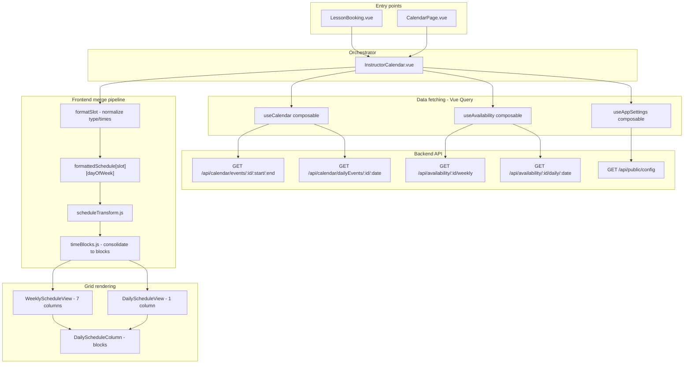

# Calendar & Scheduling System

This document is the primary reference for the calendar and scheduling subsystem. It covers the frontend component hierarchy, the data-merge pipeline, the configurable week-start feature, and the refresh coordination layer. For adjacent topics, see the linked docs at the bottom.

---

## Architecture overview

The calendar surfaces three main audiences via two different entry points:

| Route | View | Audience | `InstructorCalendar` prop |
|-------|------|----------|--------------------------|
| `/book` (student) | `BookLessonPage` → `LessonBooking` | Students booking lessons | `week-start-day="current"` |
| `/calendar` (instructor/admin) | `CalendarPage` | Instructors & admins | `week-start-day="current"` |
| `/availability` | `AvailabilityPage` | Instructors editing schedule | (different component — `InstructorAvailabilityManager`) |

`InstructorCalendar.vue` is the shared orchestrator. It is responsible for fetching data, merging availability with events, managing week/day navigation state, and opening booking/edit modals. It does not render the grid directly — it delegates to `WeeklyScheduleView` (desktop) or `DailyScheduleView` (mobile or date-picker selection).

### High-level data flow



---

## Frontend component hierarchy

### `InstructorCalendar.vue`
`frontend/src/components/InstructorCalendar.vue`

The orchestrator. Owns all scheduling state and business logic for the calendar view.

**Props:**

| Prop | Type | Default | Purpose |
|------|------|---------|---------|
| `instructor` | Object | required | Instructor record (`id` required; `User.name` used in modals) |
| `weekStartDay` | Number \| String | `0` | Which day to anchor the 7-day window on. `0-6` = fixed weekday (0=Sun); `'current'` = rolling window starting today |

**Emits:** `process-refund` (declared; consumed by parent `CalendarPage`)

**Responsibilities:**
- Computes `weekStart` from the `weekStartDay` prop and the `selectedWeek` navigation state via `computeWeekStart`.
- Passes `weekStartDate`/`weekEndDate` ISO strings as Vue Query parameters so the cache key changes as the user navigates weeks.
- Calls `fetchWeeklySchedule` (desktop 7-day) and `fetchDailySchedule` (mobile / date-picker) to merge availability + events into the slot-indexed map.
- Routes slot clicks (`handleSlotSelected`) to either the booking modal (`Booking.vue`) or the edit/cancel modal (`EditBooking.vue`) based on slot type and user role.
- Listens to `scheduleStore.refreshTrigger` to re-fetch after mutations.

---

### `WeeklyScheduleView.vue`
`frontend/src/components/WeeklyScheduleView.vue`

Renders the 7-column desktop grid. Receives the raw `weeklySchedule` map and `weekStartDate`, and calls `transformWeeklySchedule` from `scheduleTransform.js` to produce one `DailyScheduleColumn` per day. Also renders the time-label sidebar using `generateTimeLabels`.

Business hours (`earliestOpenTime`, `latestCloseTime`) from `useAppSettings` define the visible slot range; this prevents the grid from spanning midnight-to-midnight.

**Props:** `weeklySchedule`, `weekStartDate` (Date), `useColumnLayout`, `selectedSlot`, `originalSlot`

---

### `DailyScheduleView.vue`
`frontend/src/components/DailyScheduleView.vue`

Single-day equivalent of `WeeklyScheduleView`. Used on mobile (always) and on desktop when a date is selected in the date picker. Calls `transformDailySchedule` and renders one `DailyScheduleColumn`.

---

### `DailyScheduleColumn.vue`
`frontend/src/components/DailyScheduleColumn.vue`

The leaf renderer. Receives a `slots` array of consolidated `TimeBlock` objects from `timeBlocks.js` and renders each as a `Card`. Handles:
- Visual styling by block type (`available`, `booked`, `unavailable`, `google-calendar`, `rescheduling`).
- Past-time greying via `isPastDay` / `isPastTimeSlot` from `timeFormatting.js` (date-based, no extra logic needed).
- Click/hover events including 30-minute segment precision for available blocks.
- Collision detection during reschedule flow (`isRescheduling` prop).

**Emits:** `slot-selected` → `{ date, startSlot, duration, type }` (available) or full booking data (booked).

---

### Supporting booking components

| Component | File | Role |
|-----------|------|------|
| `Booking.vue` | `frontend/src/components/Booking.vue` | New booking modal body: duration choice, payment method (credits/card/in-person), student search (book-on-behalf), Stripe |
| `EditBooking.vue` | `frontend/src/components/EditBooking.vue` | Two-slide reschedule/cancel flow; slide 1 = calendar re-pick, slide 2 = confirm |
| `BookingList.vue` | `frontend/src/components/BookingList.vue` | Tabbed (today/upcoming/past/cancelled) booking list with attendance and refund actions |
| `LessonBooking.vue` | `frontend/src/components/LessonBooking.vue` | Student "Book A Lesson" card; embeds `InstructorCalendar` |

---

## Data fetching (composables)

All server state goes through Vue Query. See the [VUE_QUERY_PATTERN.md](VUE_QUERY_PATTERN.md) doc for caching conventions.

### `useCalendar.js`
`frontend/src/composables/useCalendar.js`

| Export | Endpoint |
|--------|----------|
| `weeklyEvents` (query) | `GET /api/calendar/events/:instructorId/:startDate/:endDate` |
| `dailyEvents` (query) | `GET /api/calendar/dailyEvents/:instructorId/:date` |
| `updateBooking` (mutation) | `PATCH /api/calendar/student/:bookingId` |
| `cancelBooking` (mutation) | `DELETE /api/calendar/student/:bookingId` |
| `updatePaymentStatus` (mutation) | `PUT /api/calendar/bookings/:bookingId/payment-status` |

`weeklyEvents` and `dailyEvents` return merged arrays of one-time bookings, virtual recurring events, and Google Calendar events. See [BOOKING_LIFECYCLE.md](BOOKING_LIFECYCLE.md) for the merge logic.

### `useAvailability.js`
`frontend/src/composables/useAvailability.js`

| Export | Endpoint |
|--------|----------|
| `weeklyAvailability` (query) | `GET /api/availability/:instructorId/weekly` |
| `dailyAvailability` (query) | `GET /api/availability/:instructorId/daily/:date` |
| `saveWeeklyAvailability` (mutation) | `POST /api/availability/:instructorId/weekly` |
| `createBlockedSlot` (mutation) | `POST /api/availability/:instructorId/blocked` |
| `deleteBlockedSlot` (mutation) | `DELETE /api/availability/blocked/:blockId` |
| `blockedSlots` (query) | **Disabled** (`enabled: false`) — backend incomplete |

### `useAppSettings.js`
`frontend/src/composables/useAppSettings.js`

Fetches `GET /api/public/config`. Exposes `earliestOpenTime` and `latestCloseTime` (in hours) which drive the visible slot range in both schedule views.

---

## The schedule-merge pipeline

This is the most complex part of the frontend. It transforms two independent data streams (availability rows + event objects) into a display-ready slot map.

### Step 1 — Fetch (`useCalendar` + `useAvailability`)

Vue Query fetches availability and events independently. Both are reactive; watchers in `InstructorCalendar` re-run the merge when either changes.

### Step 2 — Merge into slot-indexed map (`fetchWeeklySchedule`)

`fetchWeeklySchedule` in `InstructorCalendar.vue` (lines ~432–512) builds:

```js
formattedSchedule[slotNumber][dayOfWeek] = formattedSlotObject
```

**Availability pass:** For each availability row (`day_of_week`, `start_slot`, `duration`), compute the actual calendar date within the current window using the correct day-of-week offset:

```js
const windowStartDow = weekStart.value.getDay()
const dayOffset = (dayIndex - windowStartDow + 7) % 7
const slotDate = new Date(weekStart.value)
slotDate.setDate(slotDate.getDate() + dayOffset)
```

This formula is correct for any window start day (see [Configurable week-start feature](#configurable-week-start-feature) below). The slot is written at every `start_slot + i` position for `i = 0 .. duration-1`.

**Events pass:** Bookings and Google Calendar events overwrite availability cells at their occupied slots. All-day Google events with `blocks_all_available_slots: true` wipe the entire day column.

### Step 3 — `formatSlot` normalisation

Each raw slot object is normalised to a consistent shape:

```js
{
  id, start_slot, duration, date, type,   // type: 'available'|'booked'|'unavailable'
  startTime, endTime,                      // display strings e.g. "09:00"
  student, isOwnBooking,                   // populated for booked events
  is_google_calendar, source, is_recurring
}
```

`recurring_reserved` status is mapped to `type: 'booked'` and `is_recurring: true`.

### Step 4 — Transform to columns (`scheduleTransform.js`)

`transformWeeklySchedule(weeklySchedule, weekStartDate, minSlot, maxSlot)` in `frontend/src/utils/scheduleTransform.js`:

Iterates 7 offsets from `weekStartDate`. For each column, derives the column's `dayOfWeek = date.getDay()` and looks up `weeklySchedule[slot][dayOfWeek]`. This decoupling from the loop index (offset ≠ day-of-week unless the window starts on Sunday) is what makes non-Sunday week starts work correctly.

### Step 5 — Consolidate to blocks (`timeBlocks.js`)

`consolidateScheduleToBlocks` in `frontend/src/utils/timeBlocks.js` scans the slot range and merges consecutive same-type same-id slots into `TimeBlock` objects:

- **Unavailable gaps**: stepped in 30-min increments.
- **Available/booked/Google**: stepped in 15-min increments; same booking ID required to merge booked/blocked blocks.
- **Height**: `(duration / 2) * 40px - 4px` margin (40px = one 30-min unit).
- **Available blocks** get a `segments` array of 30-min sub-slots for click precision.

---

## Configurable week-start feature

`InstructorCalendar.vue` supports an arbitrary 7-day display window via the `weekStartDay` prop.

### `computeWeekStart(anchorDate)`

```js
function computeWeekStart(anchorDate) {
    const d = new Date(anchorDate)
    d.setHours(0, 0, 0, 0)
    if (weekStartDay === 'current') return d          // rolling: start is the anchor itself
    const target = Number(weekStartDay)               // 0-6 fixed weekday
    const diff = (d.getDay() - target + 7) % 7
    d.setDate(d.getDate() - diff)
    return d
}
```

- `'current'` mode: the window starts on `anchorDate` (typically today), giving a 7-day rolling view with no greyed-out past columns.
- Numeric mode: snaps the anchor back to the nearest preceding occurrence of `target` weekday (classic Sunday/Monday-aligned week).

### Navigation state

```
selectedWeek (ref)  ─── computeWeekStart ──► weekStart (computed)
      │                                             │
  previousWeek / nextWeek                    weekStartDate / weekEndDate
  (shift ±7 days)                           (ISO strings → Vue Query cache keys)
```

`previousWeek` and `nextWeek` shift `selectedWeek` by ±7 days. `weekStart` is always recomputed from `selectedWeek`, so the window stays consistent regardless of start-day mode.

### Past-week limit

```js
const MAX_VIEWABLE_PAST_DAYS = 56 // 8 weeks

const minWeekStart = computed(() => {
    const base = computeWeekStart(today().toDate())
    base.setDate(base.getDate() - MAX_VIEWABLE_PAST_DAYS)
    return base
})
const isAtPastLimit = computed(() => weekStart.value <= minWeekStart.value)
```

The Previous Week button binds `:disabled="isAtPastLimit"`. The DatePicker binds `:min-value="minSelectableDate"` (same 56-day offset as a `YYYY-MM-DD` string).

### "Today" reset

```js
const isCurrentWindow = computed(() => {
    const current = computeWeekStart(today().toDate())
    return weekStart.value.getTime() === current.getTime()
})
const goToCurrentWeek = () => {
    selectedWeek.value = computeWeekStart(today().toDate())
}
```

A "Today" button appears in the week-navigation bar when `!isCurrentWindow`.

---

## Schedule refresh coordination (`scheduleStore`)

`frontend/src/stores/scheduleStore.js`

After any booking mutation (create, update, cancel, refund), components call `scheduleStore.triggerInstructorRefresh(instructorId)`. This increments `refreshTrigger` and adds the instructor to `instructorsToRefresh`. `InstructorCalendar` watches `refreshTrigger` and re-fetches only if `needsRefresh(instructor.id)` is true.

| Action | Called by |
|--------|-----------|
| `triggerInstructorRefresh(id)` | `Booking.vue`, `EditBooking.vue`, `useRefunds` (post-refund) |
| `triggerGlobalRefresh()` | Available but rarely used |
| `markInstructorRefreshed(id)` | `InstructorCalendar.vue` after re-fetch completes |

---

## Known issues and inconsistencies

These are documented here, not as bugs to fix immediately, but so future developers do not reintroduce them or work around the wrong assumption.

### 1. Slot-0 comment errors in source code
`utils/abilities.js` (line 229) contains a comment stating "slot 0 = 6:00 AM". This is incorrect — slot 0 is midnight (00:00). See [SLOT_SYSTEM.md](SLOT_SYSTEM.md) for the authoritative definition.

### 2. Availability expansion is frontend-only
The backend returns contiguous availability windows (`start_slot`, `duration`). The per-15-minute expansion that populates `formattedSchedule[slot]` happens entirely in `InstructorCalendar.fetchWeeklySchedule`. There is no backend endpoint that returns individual bookable slots.

### 3. Create vs. reschedule timezone handling
`POST /api/calendar/addEvent` (create) uses the timezone-aware `isBookingAvailable` helper from `timeUtils.js`, which converts student local time to UTC before comparing against the instructor's availability window. `PATCH /api/calendar/student/:id` (reschedule) uses a simpler raw-slot comparison that does not apply the same timezone conversion. This is a pre-existing inconsistency.

### 4. Blocked-times API is incomplete
Routes exist at `GET/POST /api/availability/:id/blocked` and `DELETE /api/availability/blocked/:id`, but the corresponding database table and model getters are not implemented. The frontend `useAvailability` composable has the `blockedSlots` query set to `enabled: false` pending backend completion. The `InstructorTimeBlocking.vue` UI is partially functional as a result.

### 5. Event fetch is unbounded — no date filter in the database query

`GET /api/calendar/events/:instructorId/:startDate/:endDate` accepts a date range but `Calendar.getInstructorEvents` fetches **all** non-cancelled bookings for the instructor from the database, then filters to the window in JavaScript. The same unscoped query runs during conflict detection on create and reschedule. This is acceptably fast now but will degrade over time. Fix: push `startDate`/`endDate` into the Sequelize `WHERE` clause.

### 6. Past availability shown in past weeks
When navigating to a previous week, the green "available" blocks reflect the instructor's *current* weekly schedule, not their historical schedule. Bookings shown in the past are real DB records, but availability slots are a projection of the current pattern.

---

## Related documentation

| Topic | Document |
|-------|----------|
| Slot system (formulas, UTC vs local) | [SLOT_SYSTEM.md](SLOT_SYSTEM.md) |
| Availability model and blocking | [AVAILABILITY_AND_BLOCKING.md](AVAILABILITY_AND_BLOCKING.md) |
| Booking lifecycle (create/reschedule/cancel/recurring) | [BOOKING_LIFECYCLE.md](BOOKING_LIFECYCLE.md) |
| Google Calendar integration setup | [GOOGLE_CALENDAR_INTEGRATION.md](GOOGLE_CALENDAR_INTEGRATION.md) |
| Business hours configuration | [BUSINESS_HOURS_AVAILABILITY_FEATURE.md](BUSINESS_HOURS_AVAILABILITY_FEATURE.md) |
| 60-minute lesson pricing and durations | [60_MINUTE_LESSON_FEATURES.md](60_MINUTE_LESSON_FEATURES.md) |
| Refund system | [REFUND_SYSTEM.md](REFUND_SYSTEM.md) |
| Attendance tracking | [ATTENDANCE_TRACKING_FEATURE.md](ATTENDANCE_TRACKING_FEATURE.md) |
| CASL permissions (24-hour policy, role gates) | [CASL_PERMISSIONS_GUIDE.md](CASL_PERMISSIONS_GUIDE.md) |
| Date helpers API | [DATE_HELPERS_SYSTEM.md](DATE_HELPERS_SYSTEM.md) |
